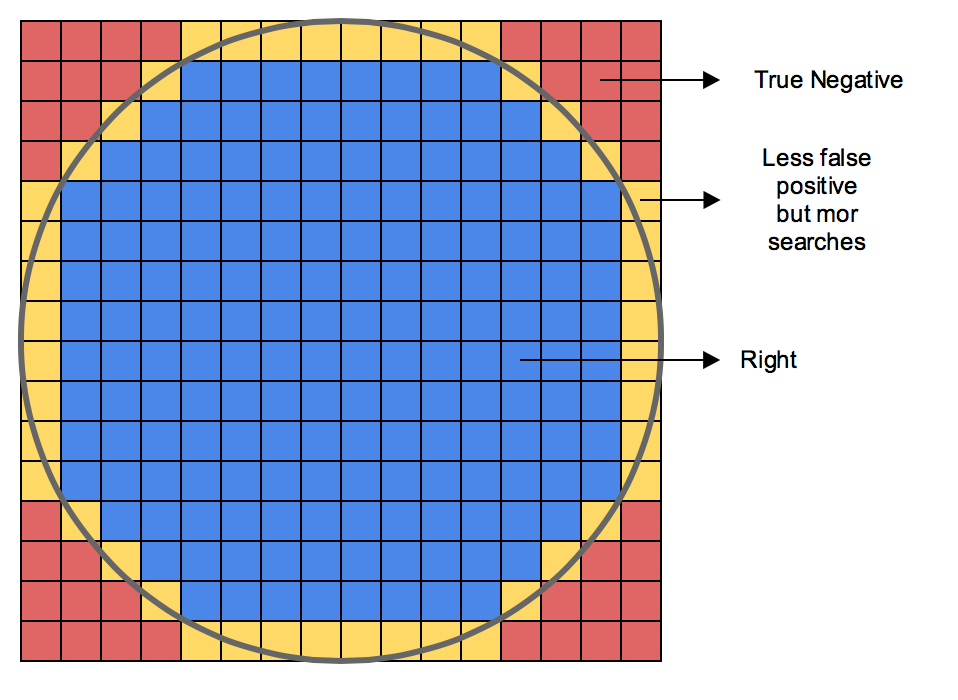

# Geo Triangles

## The Problem

The problem of representing a location with a single and efficient representation has
already been solved with the [Geohash](https://en.wikipedia.org/wiki/Geohash), that conveniently
offers variable precision - given the number of digits in the hash - as well as a practical
way to obtain the distance between two locations by simply comparing their prefixes. This
technique is already well known [with open services for it](http://geohash.org/), and even has
some [pop culture references](https://xkcd.com/426/).

However, recently we have faced a limitation with the Geohash: filtering locations that are
within a radius of another given location. Then nature of the Geohash mandates that all areas
are divided into squares, more specifically in a tree spatial structure, where all node have four
children: the upper right, upper left, lower left and lower right sub-quads.
Below is a small example of the quadtree:

This subdivision strategy obviously is not ideal for radius filtering, since translating the
square structure into circles is not trivial. The current standard found in most web applications
is to accept false positives, i.e. include into the search result all locations found in the edges
of the square that should be excluded from the radius circle, as shown in the image below. Another
approach could be subdivide a large square into smaller parts and attempt to draw a circle with
a improved resolution, this solution however would involve multiple searches since it would reach
leaves of the spatial structure, as also shown below. This inevitably could have a significant
impact on performance.

## The Solution

Our suggested solution for obtaining an answer to location search within a radius, while maintaining
a similar level of performance and flexibility available in the Geohash, is the Geotriangle. It is also
a spatial structure, where each node has four children, and also offers variable precision depending on
the number of bits in the address. Another similarity to the Geohash is that you can compare distances
between locations based on the similarity of each prefix. The Geotriangle however, as stated in its name,
deals with triangles instead of rectangles. This design decision is relevant due to the fact that with
triangles we can also work with hexagons, and therefore perform a single search (as in the Geohash) asking
whether a point is within the hexagons area, where the center of the hexagon is another location. Why
hexagons? Because they provided a closer representation of a circle compared to a rectangle. To be more
specific, working with hexagons can reduce up to ~75% of the number of false positives compared to the
rectangle performance.

## Proof

Imagine a circle with a radius equal to `r`. Now, imagine it inside a square with a side with size `2r`,
i.e. the circle will touch the square's side on exactly four points. Given that the circles area is `pi * r^2 `
and the squares are is `4 * r^2`, we can determine that performing a radius search within the square
will generate an false positive area of `(4 - pi) * r^2`.

Now imagine the same circle inside a hexagon. In this scenario each triangle would have height of `r`,
and knowing that all triangles are equilateral we can affirm that each triangle side is `(2 * r) / sqrt(3)`,
and finally with the side and height we can calculate the area of each triangle than ends up being `r^2 / sqrt(3)`.
Since the hexagon can be seen as 6 triangles, the total area of the hexagon is `(6 * (r^2)) / sqrt(3)`,
which when solved becomes approximately `3.4642 * r^2`.

If we assume that `pi = 3.1416`, we reach the following results:

* The **Square** displays a `(4 - pi) * r^2` false positive area, that when solved returns `0.8584 * r^2`
* The **Hexagon** displays a `(3.4642 - pi) * r^2` false positive area, that when solved returns `0.3226 * r^2`

In other words, the hexagon approach reduces the false positive area when performing a radius search
in approximately `62.41%`.

## Conclusion

This work is not in any way a criticism to the Geohash, only an alternative to optimizing a very specific
use case oh the Geohash spatial structure. Given that we have yet run any performance test comparing
both solutions, we recommend only using this library in cases where circle and radius operations are
involved, or if you wish to try out/contribute to the project, that in theory could very well match
the Geohash performance wise.

## Demo

Click [here] (http://fco.github.io/GeoTriangles/) to see a live demo of the solution.
